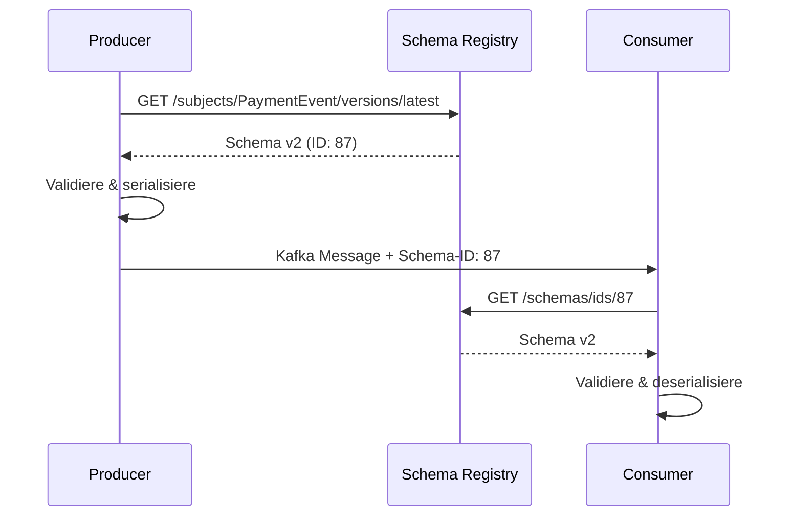

## Inhaltsverzeichnis

1. [Einleitung](#einleitung)
2. [Die Lösung: Confluent Schema Registry](#die-lösung-confluent-schema-registry)
3. [Client-Konfiguration: Anbindung an die Schema Registry](#client-konfiguration-anbindung-an-die-schema-registry)
4. [Schema Evolution & Compatibility Modes](#schema-evolution--compatibility-modes)
5. [Die Architektur des PoC](#die-architektur-des-poc)
6. [Schema-Management in der Praxis: Kommunikation & Validierung im Team](#schema-management-in-der-praxis-kommunikation--validierung-im-team)
7. [Learnings & Fazit](#learnings--fazit)

## Einleitung

In meinem aktuellen Kundenprojekt gibt es mehr als 20 fachliche Komponenten, die über Kafka-Schnittstellen miteinander kommunizieren. Die Datenmodelle sind klar definiert, ändern sich aber fast täglich, da die fachliche Spezifikation noch nicht abgeschlossen ist. Ein Stakeholderkreis entwickelt diese Datenmodelle und pflegt für jede Eingangs- und Ausgangsschnittstelle ein JSON-Schema-File, das die Kafka-Payloads validiert. Die Validierung selbst ist aktuell eine custom Implementierung je Komponente. Der gesamte Prozess für Schema-Updates läuft dabei wie folgt ab:

1. Der Stakeholderkreis macht Änderungen am fachlichen Datenmodell und am dazugehörigen JSON-Schema-File
2. Das aktuellste JSON-Schema-File wird über diverse Kanäle wie Slack und Confluence verteilt
3. Die Teams legen das Schema-File manuell in ihre Repositories
4. Die Repositories werden deployed, sodass die Schnittstellen die aktuellste JSON-Schema-Version unterstützen

Dieser manuelle Prozess hat in der Praxis zu mehreren konkreten Problemen geführt:

- **Versionskonflikte**: Producer wird mit Schema v2 deployed, Consumer läuft noch mit v1 → Deserialisierung schlägt fehl
- **Breaking Changes**: Änderungen an required-Feldern brechen unbemerkt alte Consumer, da es keine zentrale Kompatibilitätsprüfung gibt
- **Kommunikationsfehler**: Teams übersehen Slack-Nachrichten oder Confluence-Updates und deployen mit veralteten Schema-Versionen
- **Fehlendes Rollback**: Wenn ein neues Schema Probleme verursacht, ist unklar welche Version die letzte funktionierende war

Um diese Probleme zu lösen und den Schema-Management-Prozess zu zentralisieren und zu automatisieren, kommt die Confluent Schema Registry ins Spiel.

Mit diesem PoC wollte ich herausfinden:

- Wie lässt sich die Schema Registry in eine Spring Boot Anwendung integrieren?
- Wie funktioniert die automatische Schema-Validierung beim Serialisieren und Deserialisieren?
- Was sind Subject Naming Strategies und welche passt zu unserem Use Case?
- Wie gehe ich mit Schema-Evolution um und welche Compatibility Modes gibt es?
- Wie kann ich Validierungsfehler elegant behandeln?

## Die Lösung: Confluent Schema Registry

Im Projekt wird bereits die Confluent Platform mit all ihren Komponenten eingesetzt. Die Confluent Platform enthält neben Kafka Brokern, dem Control Center und Client Libraries für Consumer und Producer auch die Schema Registry. Die Schema Registry ist eine zentrale Komponente, die sich nahtlos in den Confluent Stack integriert. Sie dient der zentralen Verwaltung von Schemas und unterstützt neben Avro und Protobuf auch JSON Schema – genau das Format, das wir im Projekt verwenden.

In der Schema Registry werden Schemas versioniert unter sogenannten Subjects abgelegt. Ein Subject ist ein logischer Container-Name (z.B. "PaymentEvent"), unter dem mehrere Versionen desselben Schemas verwaltet werden. Jede Schema-Version erhält eine global eindeutige Schema-ID sowie eine Subject-spezifische Versionsnummer. Die Registry speichert dabei nicht nur das Schema selbst, sondern auch Metadaten wie den konfigurierten Compatibility Mode (z.B. BACKWARD oder FULL) auf Subject-Ebene.

**Subject-Struktur im Detail:**

Subject = Logischer Container/Name (z.B. "PaymentEvent")
  - Unter einem Subject liegen mehrere Versionen (v1, v2, v3, ...)
  - Jede Version ist ein eigenes Schema-File

```
Subject: "PaymentEvent"
  ├── Version 1 (Schema-ID: 42)
  ├── Version 2 (Schema-ID: 87)
  └── Version 3 (Schema-ID: 133) ← latest
```

**Metadaten existieren auf zwei Ebenen:**

1. **Subject-Ebene:**
   - Compatibility Mode (gilt für alle Versionen)
   - Latest Version Pointer

2. **Schema-Version-Ebene (jede Version hat):**
   - Schema-ID (global eindeutig über alle Subjects)
   - Versionsnummer (1, 2, 3... innerhalb des Subjects)
   - Schema-Content (das eigentliche JSON Schema)
   - Schema-Typ (JSON/Avro/Protobuf)

## Client-Konfiguration: Anbindung an die Schema Registry

Um die Schema Registry in einer Spring Boot Anwendung zu nutzen, müssen Producer und Consumer über spezifische Konfigurationen mit der Registry verbunden werden – dabei gibt es mehrere Parameter, die das Verhalten der automatischen Schema-Validierung steuern.

**Producer-Konfiguration:**

```properties
# Verbindung zur Schema Registry
schema.registry.url=http://localhost:8081

# Serializer für JSON Schema
value.serializer=io.confluent.kafka.serializers.KafkaJsonSchemaSerializer

# Schema-Registrierung
auto.register.schemas=false

# Subject Naming Strategy
value.subject.name.strategy=io.confluent.kafka.serializers.subject.RecordNameStrategy
```

- **`schema.registry.url`**: URL der Schema Registry (Pflichtparameter)
- **`value.serializer`**: Confluent-Serializer, der Objekte zu JSON serialisiert, gegen das Schema validiert und die Schema-ID in den Message Header einbettet
- **`auto.register.schemas=false`**: Verhindert automatische Schema-Registrierung. In Produktion sollten Schemas explizit über einen kontrollierten Prozess registriert werden, um versehentliche Breaking Changes zu vermeiden
- **`value.subject.name.strategy`**: Definiert, wie Subject-Namen gebildet werden (mehr dazu im nächsten Abschnitt)

**Consumer-Konfiguration:**

```properties
# Verbindung zur Schema Registry
schema.registry.url=http://localhost:8081

# Deserializer für JSON Schema
value.deserializer=io.confluent.kafka.serializers.KafkaJsonSchemaDeserializer

# Schema-Version
use.latest.version=true

# Kompatibilitätsprüfung
latest.compatibility.strict=false
```

- **`value.deserializer`**: Confluent-Deserializer, der die Schema-ID aus dem Message Header liest, das Schema aus der Registry holt und die Nachricht validiert
- **`use.latest.version=true`**: Consumer verwendet immer die neueste Version des Subjects, unabhängig von der Schema-ID im Message Header
- **`latest.compatibility.strict=false`**: Vertraut der Kompatibilitätsprüfung der Registry, statt eine zusätzliche Client-seitige Prüfung durchzuführen

**Subject Naming Strategies:**

Beim Serialisieren einer Kafka-Nachricht im Client muss der Confluent-Serializer automatisch wissen, unter welchem Subject-Namen er das passende Schema in der Registry finden kann. Die Subject Naming Strategy definiert die Regel, nach der dieser Subject-Name gebildet wird. Je nach Anwendungsfall gibt es drei verschiedene Strategien, die unterschiedliche Vor- und Nachteile haben:

1. **TopicNameStrategy** (Default)
   - Subject-Name = `{topic}-value`
   - Beispiel: Topic "payments" → Subject "payments-value"

2. **RecordNameStrategy**
   - Subject-Name = Record-Typ (z.B. Klassenname oder `@JsonSchemaTitle` -> Wird im nächsten Kapitel genauer erklärt)
   - Beispiel: `de.kundenprojekt.v1.PaymentEvent`

3. **TopicRecordNameStrategy**
   - Subject-Name = `{topic}-{recordType}`
   - Beispiel: "payments-PaymentEvent"

Im Kundenprojekt werden dieselben JSON-Schema Files bereits für verschiedene Topics verwendet – daher ist die **RecordNameStrategy** die einzig sinnvolle Wahl. Ein Schema wie "PaymentEvent" kann so über mehrere Topics hinweg wiederverwendet werden, ohne dass es für jedes Topic separat registriert werden muss.

> **ℹ️ Info:** Die Parameter `use.latest.version` und `latest.compatibility.strict` stehen in direktem Zusammenhang mit der Schema-Evolution. Wie Schemas kompatibel weiterentwickelt werden können und welche Compatibility Modes es gibt, wird im nächsten Kapitel behandelt.

## Schema Evolution & Compatibility Modes

Ein zentraler Vorteil der Schema Registry ist die Möglichkeit zur kontrollierten Schema-Evolution. Datenmodelle ändern sich im Laufe der Zeit – neue Felder kommen hinzu, alte werden entfernt oder umbenannt. Die entscheidende Frage ist: Wie können Schemas weiterentwickelt werden, ohne dass bestehende Producer oder Consumer brechen?

**Das Problem der Schema-Evolution:**

Kurze Anekdote von einem Fall, den wir im Projekt genau so hatten: Ein Producer sendet Nachrichten mit einem Schema, das vom Stakeholderkreis eine Woche zuvor angepasst wurde – zur Veranschaulichung nennen wir es hier Schema XY Version 1. Plötzlich wurde dem Schema XY ein neues required-Feld hinzugefügt (aus Version 1 wurde also Version 2). Das aktualisierte Schema wurde dem Producer eingespielt, dem dazugehörigen Consumer jedoch nicht. Was passiert mit den Consumern, die noch Version 1 erwarten? Sie brechen, weil sie aufgrund des neuen required-Feldes die Version-2-Nachrichten nicht deserialisieren können.

Die Schema Registry löst dieses Problem durch **Compatibility Modes** – Regeln, die definieren, welche Schema-Änderungen erlaubt sind.

**Die vier Compatibility Modes:**

**1. BACKWARD (Rückwärtskompatibel)**

Neue Schema-Versionen können von alten Consumern gelesen werden.

<div style="background: #0a1f1a; border-left: 4px solid #059669; padding: 1rem; border-radius: 0.5rem; margin: 1rem 0;">

**Erlaubt:**
- Felder hinzufügen (mit Default-Werten)
- Felder entfernen (die optional waren)

</div>

<div style="background: #1a0a0a; border-left: 4px solid #dc2626; padding: 1rem; border-radius: 0.5rem; margin: 1rem 0;">

**Verboten:**
- Required-Felder hinzufügen
- Feld-Typen ändern

</div>

**Deployment-Reihenfolge:** Consumer zuerst, dann Producer
**Use Case:** Standard-Fall – Consumer werden typischerweise vor Producern deployed

**2. FORWARD (Vorwärtskompatibel)**

Alte Schema-Versionen können von neuen Consumern gelesen werden.

<div style="background: #0a1f1a; border-left: 4px solid #059669; padding: 1rem; border-radius: 0.5rem; margin: 1rem 0;">

**Erlaubt:**
- Felder entfernen
- Optional Felder hinzufügen

</div>

<div style="background: #1a0a0a; border-left: 4px solid #dc2626; padding: 1rem; border-radius: 0.5rem; margin: 1rem 0;">

**Verboten:**
- Required-Felder hinzufügen
- Feld-Typen ändern

</div>

**Deployment-Reihenfolge:** Producer zuerst, dann Consumer
**Use Case:** Wenn Producer schneller deployed werden als Consumer

**3. FULL (Bidirektional kompatibel)**

Kombination aus BACKWARD und FORWARD – die strengste Variante.

<div style="background: #0a1f1a; border-left: 4px solid #059669; padding: 1rem; border-radius: 0.5rem; margin: 1rem 0;">

**Erlaubt:**
- Nur optional Felder mit Defaults hinzufügen
- Optional Felder entfernen

</div>

<div style="background: #1a0a0a; border-left: 4px solid #dc2626; padding: 1rem; border-radius: 0.5rem; margin: 1rem 0;">

**Verboten:**
- Fast alles andere

</div>

**Deployment-Reihenfolge:** Beliebig
**Use Case:** Maximale Sicherheit, wenn Deployment-Reihenfolge unklar ist

**4. NONE (Keine Prüfung)**

Alle Änderungen sind erlaubt – keine Kompatibilitätsprüfung.

**Use Case:** Nur für Entwicklung/Tests oder wenn manuelle Kontrolle erfolgt

> **ℹ️ Info:** Die Compatibility Modes basieren auf dem **Tolerant Reader Pattern**: Die Confluent Serializer/Deserializer ignorieren automatisch unbekannte Felder, sodass alte Consumer neue Schema-Versionen verarbeiten können (BACKWARD) und neue Consumer alte Versionen verstehen (FORWARD). Ohne diese Toleranz würden selbst kompatible Schema-Änderungen zu Fehlern führen.

**Konfiguration der Compatibility Modes:**

Compatibility Modes können global oder pro Subject konfiguriert werden:

```bash
# Global für alle Subjects
curl -X PUT -H "Content-Type: application/vnd.schemaregistry.v1+json" \
  --data '{"compatibility": "BACKWARD"}' \
  http://localhost:8081/config

# Für ein spezifisches Subject
curl -X PUT -H "Content-Type: application/vnd.schemaregistry.v1+json" \
  --data '{"compatibility": "FULL"}' \
  http://localhost:8081/config/PaymentEvent
```

**Wie funktioniert die Validierung?**

Wenn ein neues Schema in der Registry registriert wird:
1. Registry holt die letzte Version des Subjects
2. Prüft das neue Schema gegen den konfigurierten Compatibility Mode
3. **Akzeptiert** das Schema, wenn es kompatibel ist
4. **Lehnt ab**, wenn es inkompatibel ist (HTTP 409 Conflict)

Das verhindert, dass versehentlich Breaking Changes deployed werden.

**Best Practices:**

- **BACKWARD als Default:** Deckt die meisten Use Cases ab (Consumer-first Deployment)
- **Schema-Design von Anfang an:** Felder optional machen, sinnvolle Defaults setzen
- **Niemals NONE in Produktion:** Außer bei manueller Governance
- **Kompatibilität testen:** Im CI/CD-Pipeline Schema-Registrierung testen
- **Semantic Versioning für Breaking Changes:** Bei Breaking Changes ein neues Subject mit neuer Major-Version anlegen (z.B. `de.kundenprojekt.v1.PaymentEvent` → `de.kundenprojekt.v2.PaymentEvent`). So können alte und neue Versionen parallel existieren und eine schrittweise Migration ist möglich

In meinem PoC habe ich **BACKWARD** als Compatibility Mode gewählt, da dies dem Standard-Deployment-Pattern im Kundenprojekt entspricht: Consumer-Komponenten werden zuerst aktualisiert, dann die Producer.

## Die Architektur des PoC

Der PoC bildet den für das Kundenprojekt spezifischen Workflow einer Komponente ab: Ein Producer schickt Kafka-Nachrichten los, die beim Serialisieren automatisch gegen ein Schema aus der Registry validiert werden. Auf der anderen Seite konsumiert ein Consumer Nachrichten und validiert diese beim Deserialisieren ebenfalls gegen das Schema aus der Registry.

**Producer-Consumer-Flow mit Schema Registry:**



**Der Flow im Detail:**

**Producer-Seite:**

1. Producer erstellt ein `PaymentEvent`-Objekt
2. `KafkaJsonSchemaSerializer` fragt Registry nach neuester Version des Subjects "PaymentEvent"
3. Registry gibt Schema Version 2 mit globaler Schema-ID 87 zurück
4. Serializer validiert das Objekt gegen das Schema
5. Bei erfolgreicher Validierung: JSON + Schema-ID 87 im Message-Header → Kafka Topic

**Consumer-Seite:**

6. Consumer liest Nachricht aus Kafka Topic
7. `KafkaJsonSchemaDeserializer` liest Schema-ID 87 aus dem Message-Header
8. Deserializer fragt Registry nach Schema mit ID 87
9. Registry gibt das exakte Schema zurück (PaymentEvent v2)
10. Deserializer validiert die Nachricht gegen das Schema und deserialisiert zu einem Java-Objekt

**Wichtige Details:**
- Die **Schema-ID im Header** ist der Schlüssel: Consumer braucht weder Subject-Name noch Versionsnummer zu kennen
- Validierung passiert **automatisch** – kein manueller Code nötig
- Bei Validierungsfehlern greift der `SchemaValidationErrorHandler`

## Schema-Management in der Praxis: Kommunikation & Validierung im Team

Die Schema Registry löst viele technische Probleme – aber wie sieht der tägliche Workflow aus, wenn der Stakeholderkreis ein neues Schema deployed? Vertrauen ist gut, Kontrolle ist besser: Wie stellen wir sicher, dass Producer und Consumer auch wirklich kompatibel sind?

**Der Schema-Update-Workflow:**

1. **Stakeholderkreis registriert neue Schema-Version**
   - Neues Schema wird in der Registry unter dem Subject registriert
   - Registry prüft Kompatibilität (BACKWARD Mode)
   - Bei Erfolg: Neue Version verfügbar (z.B. PaymentEvent v3)

2. **Team-Kommunikation**
   - Automatische Benachrichtigung über Schema-Änderung (z.B. Slack, E-Mail)
   - Dokumentation: Welche Felder wurden hinzugefügt/geändert?
   - Link zur Registry-UI oder Confluence-Seite

3. **DTO-Anpassung in den Komponenten**
   - Teams passen ihre Java-DTOs an das neue Schema an
   - Neue Felder werden hinzugefügt, alte optional entfernt
   - `@JsonSchemaTitle` bleibt unverändert (z.B. "PaymentEvent")

Es bleibt trotzdem die allgegenwertige Frage: Kann man das nicht automatisieren?

**Integration Testing: Producer vs. Consumer**

Die zentrale Frage: Kann der Consumer die Nachrichten des Producers mit dem neuen Schema verarbeiten?

**Ansatz: Contract Testing mit Schema Registry**

```java
@Testcontainers
@SpringBootTest
class SchemaCompatibilityIntegrationTest {

    @Container
    static KafkaContainer kafka = new KafkaContainer(
        DockerImageName.parse("confluentinc/cp-kafka:7.9.0")
    );

    @Container
    static SchemaRegistryContainer schemaRegistry =
        new SchemaRegistryContainer(kafka);

    @Test
    void producerCanSerializeAgainstLatestSchema() {
        // Producer serialisiert gegen Schema Registry
        PaymentEvent event = new PaymentEvent(/* ... */);

        // Serializer holt automatisch latest Schema aus der RegistryHey 
        byte[] serialized = serializer.serialize("payments", event);

        assertThat(serialized).isNotNull();
        // Wenn Serialisierung klappt → Schema ist kompatibel
    }

    @Test
    void consumerCanDeserializeProducerMessages() {
        // Producer sendet Nachricht
        PaymentEvent producerEvent = new PaymentEvent(/* ... */);
        byte[] message = producerSerializer.serialize("payments", 
                producerEvent);

        // Consumer deserialisiert
        PaymentEvent consumerEvent = consumerDeserializer.deserialize(
                "payments", message);

        assertThat(consumerEvent).isNotNull();
        assertThat(consumerEvent.getPaymentId()).isEqualTo(
                producerEvent.getPaymentId());
        // Consumer kann Producer-Nachricht verarbeiten
    }
}
```

Im Test wird geprüft, ob der Producer gegen das Schema in der Registry serialisieren kann, ob der Consumer die Producer-Nachricht deserialisieren kann, ob keine Daten verloren gehen und ob die Registry als Single Source of Truth genutzt wird statt manueller Schema-Files.

**CI/CD Pipeline Integration:**

```yaml
# .github/workflows/schema-compatibility.yml
steps:
  - name: Start Schema Registry (TestContainers)
    run: docker-compose up -d schema-registry

  - name: Run Integration Tests
    run: ./gradlew integrationTest

  - name: Check Schema Compatibility
    run: |
      # Versuche neues Schema zu registrieren
      curl -X POST http://localhost:8081/subjects/PaymentEvent/versions \
        -H "Content-Type: application/json" \
        -d @src/main/resources/payment-event-schema.json

      # Exit Code 409 = Inkompatibel → Build schlägt fehl
```

Dieser Ansatz ermöglicht es, Schema-Inkompatibilität bereits im CI zu erkennen, die Tests nutzen eine echte Schema Registry via TestContainers und es ist kein manueller Test-Aufwand nötig, da die Registry als Single Source of Truth dient statt lokaler Schema-Files.

**Alternative: Code-Generierung aus Schemas**

Manche Teams generieren DTOs automatisch aus JSON Schemas:

```bash
# JSON Schema → Java POJO
jsonschema2pojo --source schemas/payment-event.json \
                --target src/main/java/generated/
```

Dieser Ansatz funktioniert jedoch nicht bei komplexen Schema Files mit stark verschachtelten Conditions wie `allOf`, `not`, `if`, `then`, `else` – die Code-Generatoren können diese Konstrukte oft nicht korrekt in Java-DTOs übersetzen.

Im PoC habe ich **manuelle DTOs mit `@JsonSchemaTitle`** gewählt, da unsere Schemas zu komplex für automatische Code-Generierung sind und manuelle DTOs mehr Flexibilität bieten.

## Learnings & Fazit

Persönliche Meinung von mir: Das ungeschönte Fazit der Einführung einer Schema-Registry ist, dass nicht die Technik das Problem ist, sondern die Kommunikation unter den Teams. Besonders das Verbreiten des Know-Hows wie die Schema-Registry funktioniert, welche Anpassungen gemacht werden müssen, zu prüfen ob diese Anpassungen wirklich überall durchgeführt wurden - das ist im Endeffekt das, was die Einführung eines solchen Features teamübergreifend bzw. projektweit komplex und aufwändig macht.

Danke fürs Lesen!
Jan <3 