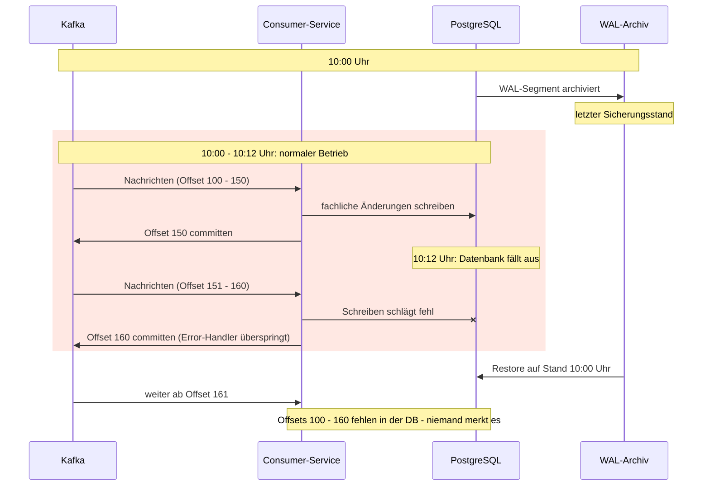

## Inhaltsverzeichnis

1. [Diskussion im Kundenprojekt](#diskussion-im-kundenprojekt)
2. [Wie ist die Situation?](#wie-ist-die-situation)
3. [Kafka ist keine Datenbank](#kafka-ist-keine-datenbank)
4. [Das Inbox-Pattern](#das-inbox-pattern)
5. [Weitere Trade-offs und Learnings](#weitere-trade-offs-und-learnings)
6. [Fazit](#fazit)

## Diskussion im Kundenprojekt

In meinem aktuellen Kundenprojekt gibt es mehr als 20 fachliche Komponenten, die über Kafka miteinander asynchron kommunizieren. Als Architekt begleite ich gerade eine wichtige Diskussion: Was tun wir eigentlich, wenn heute Nachmittag die PROD-Datenbank eines unserer Consumer-Services wegbricht und wir sie aus einem 15 Minuten alten Backup wiederherstellen müssen?

## Wie ist die Situation?

Wir nutzen PostgreSQL. Als Backupstrategie fahren wir zweigleisig: ein physisches Basisbackup und das kontinuierliche Archivieren des Transaktionslogs.

In PostgreSQL heißt das Transaktionslog WAL (Write-Ahead Log). Das Prinzip: Bevor eine Änderung in die eigentlichen Datendateien geschrieben wird, landet sie zuerst sequenziell als Eintrag im WAL. Daraus ergeben sich zwei Vorteile:

- Crash Recovery: Nach einem Absturz spielt PostgreSQL beim Start die WAL-Einträge erneut ein (Replay) und bringt die Datendateien wieder in einen konsistenten Zustand.
- Point-in-Time Recovery (PITR): Wenn man die WAL-Dateien kontinuierlich archiviert, kann man sie auf ein Basisbackup einspielen und den Datenstand bis zu einem beliebigen späteren Zeitpunkt nachziehen, zumindest bis zum letzten archivierten WAL-Segment.

Bei uns übernimmt das pgBackRest mit einem Full Backup am Wochenende, einem täglichen Delta-Backup und einer WAL-Archivierung alle 15 Minuten. Dieses Intervall ist eine Compliance-Vorgabe und begrenzt den maximalen Datenverlust auf genau diese 15 Minuten.

> **ℹ️ Info:** Ein klassischer pg_dump (logischer Dump) lässt sich nicht mit WAL-Replay kombinieren. pg_dump exportiert die Daten als SQL-Statements, das WAL beschreibt dagegen Änderungen an physischen Datenblöcken. Nach einem logischen Restore passen diese Blöcke nicht mehr zusammen, WAL-Replay funktioniert daher nur auf einem physischen Basisbackup.

## Kafka ist keine Datenbank

Was passiert nun, wenn die Datenbank wegbricht und mit den oben genannten Backup-Mechanismen wiederhergestellt werden muss? Die DB steht danach auf dem Stand des letzten archivierten WAL-Segments, die Kafka-Consumer setzen aber am zuletzt committeten Offset wieder auf. Alles, was in der Lücke dazwischen verarbeitet wurde, ist damit still verloren. Je nach Error-Handling gilt das sogar für Nachrichten, die während des Ausfalls eintreffen: Spring Kafka überspringt eine Nachricht im Default nach mehreren fehlgeschlagenen Versuchen und committet ihren Offset trotzdem (auto-commit). Da die Offsets nicht in der DB liegen, bekommt davon niemand etwas mit. Das folgende Diagramm zeigt die zeitliche Abfolge bis zum Ausfall der Datenbank und was ab dort schief läuft:

Eine naheliegende Idee wäre es, die Offsets der Consumer Group für die betroffenen Topics per Timestamp zurückzusetzen. Allein ist das aber riskant, da man den genauen Zeitpunkt nur schwer bestimmen kann: Setzt man zu spät auf, verliert man Nachrichten, setzt man zu früh auf, entstehen Duplikate. Wir brauchen also beides: einen großzügigen Offset-Reset und eine Duplikatprüfung, die automatisiert erkennt, welche Nachrichten bereits verarbeitet wurden.

## Das Inbox-Pattern

Die Lösung für das geschilderte Problem ist eine neue Tabelle - die sogenannte Inbox-Tabelle - die den State über die bereits verarbeiteten Kafka-Nachrichten hält. In dieser Inbox steht also alles, was wir bereits erfolgreich aus dem Topic konsumiert und in die fachliche Tabelle geschrieben haben, z.B. in Form einer eindeutigen Message-ID.

Wird die Datenbank aus dem Backup wiederhergestellt, so wird die Inbox mit zurückgesetzt und zeigt genau die Kafka-Nachrichten an, die zum Stand des Backups verarbeitet waren, da der State mit derselben DB-Transaktion in diese Inbox geschrieben wird wie in die fachliche Tabelle. Setzt man dazu nach dem Einspielen des Backups jetzt noch den Offset weit genug zurück (Restore-Zeitpunkt minus Puffer), so kann die Applikation genau erkennen, welche Nachrichten schon da waren - diese werden verworfen - und welche in die normale Verarbeitung gehen.

> **ℹ️ Info:** Das Gleiche funktioniert übrigens auch auf der ausgehenden Seite über eine sogenannte Outbox-Tabelle für den Producer. Mit dem Outbox-Pattern kann sichergestellt werden, dass Nachrichten via Kafka nicht verloren gehen und nur zusammen mit der fachlichen Änderung verschickt werden. Doppelt verschickt werden können sie aber trotzdem, der Empfänger braucht also weiterhin eine Inbox.

## Weitere Trade-offs und Learnings

Im Restore-Fall birgt das Inbox-Pattern mehrere Fallstricke, die ich hier gerne noch nach Priorität und Kritikalität betrachten würde:

1. Ausgehende Nachrichten nach einem Restore: Wie wir festgestellt haben, haben wir nach einem DB-Restore einen DB-Gap, den wir aus den Kafka-Nachrichten wiederherstellen. Daraus resultiert aber auch, dass aus diesen Gap-Nachrichten neue ausgehende Nachrichten entstehen. Für den Folgeservice, der diese konsumiert, bedeutet das: Auch hier brauchen wir das Inbox-Pattern, um diese Nachrichten abzufangen und eine Mehrfachverarbeitung zu vermeiden. Leitet der Folgeservice seine Inbox-Einträge von der Message-ID ab und vergeben wir diese ID NICHT deterministisch, so erkennt der Folgeservice die Duplikate trotz Inbox-Pattern nicht. Eine wichtige Erkenntnis ist also, dass das Inbox-Pattern nur den eigenen Service rettet - Konsistenz ist jedoch nur dann gegeben, wenn alle Services eine Inbox implementieren und je Nachricht einen Marker in der Inbox vorhalten, der deterministisch ist, um wiederkehrende gleiche Nachrichten zuverlässig zu erkennen.

2. Retention der Topics: Wiederherstellen können wir nur das, was in Kafka noch liegt. Die Retention der betroffenen Topics muss also länger sein als der Backup-Abstand plus die Dauer des Restores: Das Full Backup, Delta-Backups und WAL-Replay brauchen je nach Datenmenge schnell mehrere Stunden.

3. Performance im Normalbetrieb: Die Inbox kostet uns bei jeder einzelnen Nachricht einen zusätzlichen Insert und eine Duplikatprüfung - das dauerhaft und für einen Fall, der hoffentlich nie eintritt. Ohne Index auf dem Marker wird die Prüfung je nach Datenmenge schnell zu einem Bottleneck, und die Inbox-Tabelle selbst braucht einen Cleanup, der frühestens den Zeitraum freigibt, den wir im Disaster-Recovery-Fall nachverarbeiten müssen.

## Fazit

Auf den ersten Blick hört sich das Inbox- und Outbox-Pattern trivial an, doch je mehr Services man verwaltet, auf desto mehr Hürden stößt man auch. Eine besonders harte Nuss, an der ich gerade zu knacken habe, ist der Faktor Datenschutz und personenbezogene Daten, denn auch diese liegen in den Inbox- und Outbox-Tabellen und müssen auf Anfrage mit ausgegeben und gelöscht werden können. Dazu kann ich ggf. mal einen komplett eigenen Artikel schreiben. Dennoch bin ich der Meinung, dass das Inbox-Pattern unverzichtbar in asynchronen Landschaften ist - je nach Kritikalität der Daten erst recht. Denn niemand möchte vor einem Ausfall stehen und sich sagen: "Ich habe da doch mal einen coolen Blog-Artikel gelesen ... hätte ich mir das mal zu Herzen genommen."

Danke fürs Lesen,
Euer Jan <3
